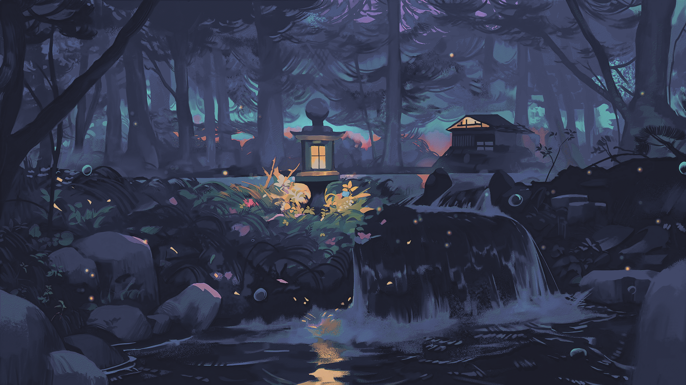

### Some wallpapers that I use.
- If an image's resolution is too low for you, use the AI Image Upscaler [here](https://www.iloveimg.com/upscale-image) or any other similar tool.
- You can apply [Catppuccin](https://github.com/catppuccin/catppuccin) flavors to your wallpapers using the [Catppuccinifier](https://github.com/lighttigerXIV/catppuccinifier).
- All credits go to the **original creators** of these images.
- More images to come.

 

###### Source: unknown    

###### Source: [KDE MegaRelease 6 Announcement](https://kde.org/announcements/megarelease/6/) 

###### Source: unknown    

###### Source: unknown    

###### Source: unknown    

###### Source: unknown    

###### Source: unknown     

###### Source: unknown     

###### Source: unknown     

###### Source: unknown     

###### Source: unknown     

###### Source: unknown     

###### Source: unknown     

[Catppuccin Discord]: https://discord.com/servers/907385605422448742
[Dominique van Velsen]: https://www.deviantart.com/dominique-van-velsen
