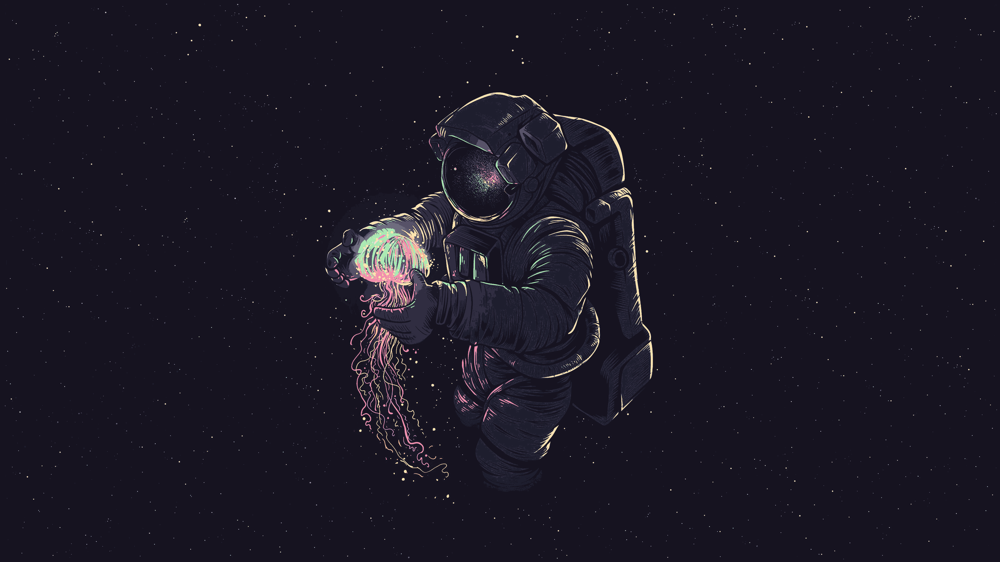

### Some wallpapers that I use.

- If an image's resolution is too low for you, [search](https://www.google.com/search?q=ai+image+upscale+free) for an AI image upscaler.
- You can apply [Catppuccin](https://github.com/catppuccin/catppuccin) flavors to your wallpapers using the [Catppuccinifier](https://github.com/lighttigerXIV/catppuccinifier).
- All credits go to the **original creators** of these images.
- More images to come.

 

###### Source: unknown 

###### Credit: [Dominique van Velsen][Dominique van Velsen] 

###### Credit: [焦茶][焦茶] 

###### Source: [KDE MegaRelease 6 Announcement](https://kde.org/announcements/megarelease/6/) 

###### Source: unknown 

###### Source: unknown 

###### Source: unknown 

###### Source: unknown 

###### Source: unknown 

###### Source: unknown 

###### Source: unknown 

###### Source: unknown 

###### Source: unknown 

###### Source: unknown 

###### Source: unknown 

[Catppuccin Discord]: https://discord.com/servers/907385605422448742
[Dominique van Velsen]: https://www.deviantart.com/dominique-van-velsen
[焦茶]: https://twitter.com/BARD713
