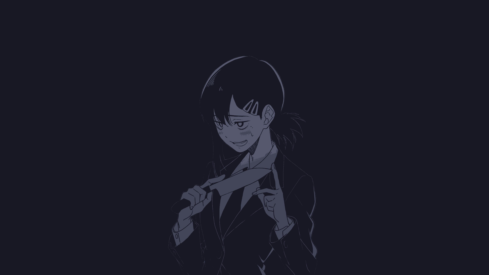
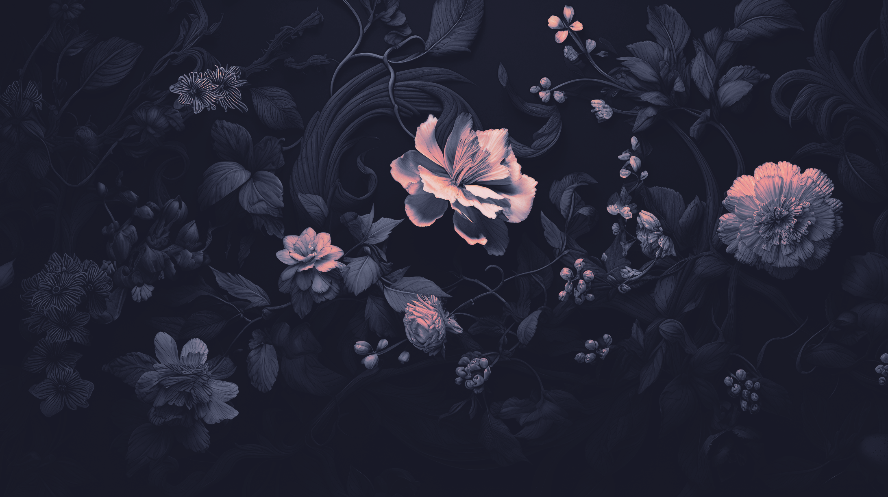
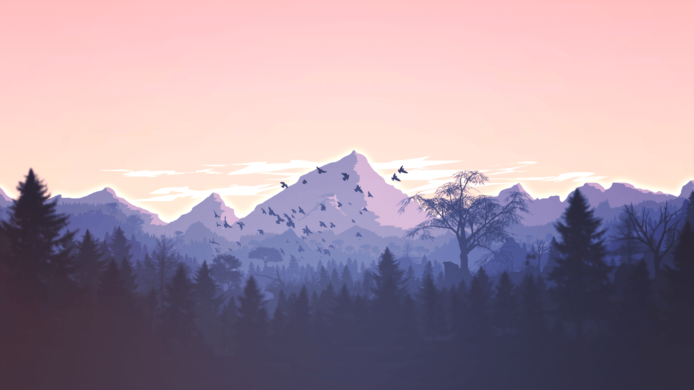

### Some wallpapers that I use.

- If an image's resolution is too low for you, [search](https://www.google.com/search?q=ai+image+upscale+free) for an AI image upscaler.
- You can apply [Catppuccin](https://github.com/catppuccin/catppuccin) flavors to your wallpapers using the [Catppuccinifier](https://github.com/lighttigerXIV/catppuccinifier). The `flake.nix` file in this repo has a [devshell](https://nix.dev/concepts/flakes.html) output which gives you the Catppuccinifier. Run `nix develop` to access the tool.
- All credits go to the **original creators** of these images.
- Pull requests are _kinda_ welcome?

 

###### Credit: [焦茶][焦茶] 

###### OG Source: unknown 

###### OG Source: unknown 

###### OG Source: unknown 

###### OG Source: unknown 

###### Credit: [Dominique van Velsen][Dominique van Velsen] 

###### Source: [wallhaven-cc](https://wallhaven.cc/w/3zdjvy) 

###### Source: [alphacoders](https://wall.alphacoders.com/big.php?i=1330260) 

###### Source: [KDE MegaRelease 6 Announcement](https://kde.org/announcements/megarelease/6/) 

###### Source: unknown 

###### OG Source: unknown 

###### Source: unknown 

###### Source: unknown 

###### Source: unknown 

###### Source: unknown 

###### Source: unknown 

###### Source: unknown 

###### Source: unknown 

###### OG Source: unknown 

[Catppuccin Discord]: https://discord.com/servers/907385605422448742
[Dominique van Velsen]: https://www.deviantart.com/dominique-van-velsen
[焦茶]: https://twitter.com/BARD713
